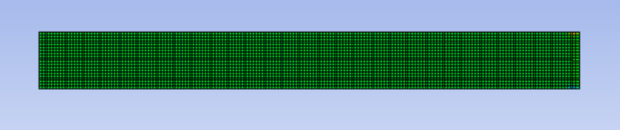
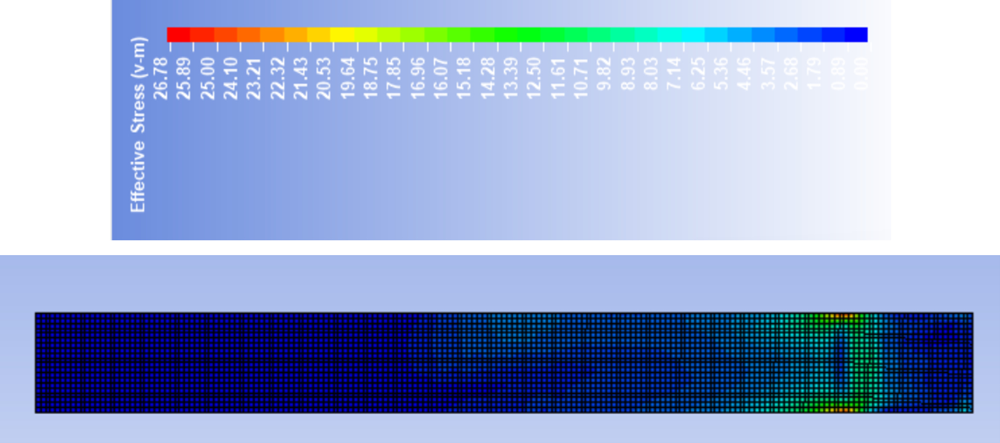
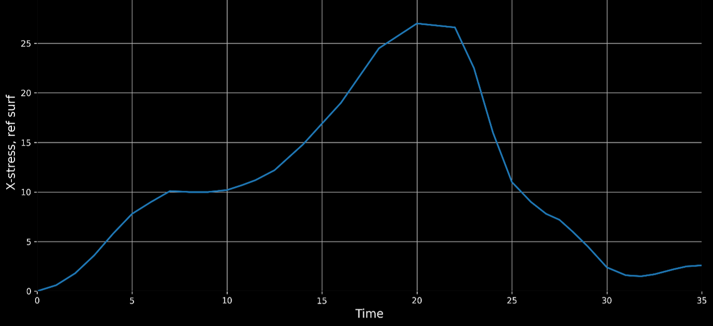
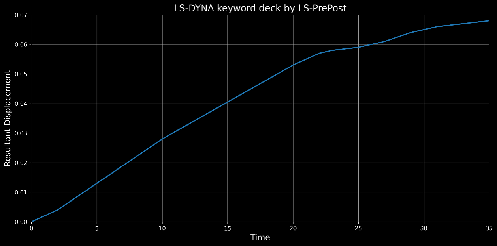
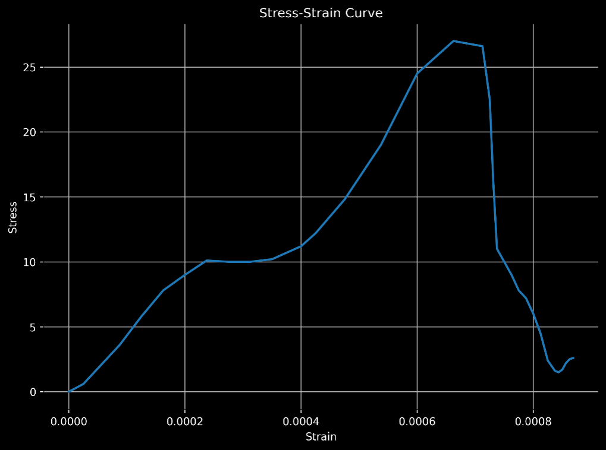

# fem-timber-plate-ls-dyna-progressive-damage
Finite element modelling of a timber plate using LS-DYNA for progressive damage and post-peak softening analysis.
# Finite Element Modelling of a Timber Plate Using LS-DYNA: A Technical Project on Progressive Damage Analysis

## Project Overview
This project presents the finite element modelling (FEM) of a timber plate subjected to uniaxial tensile loading using LS-DYNA. The main objective is to evaluate the structural response and progressive damage behaviour of timber through the application of the damage-based material model MAT_054.

The study was developed as a technical engineering project to demonstrate practical competency in numerical modelling, mesh discretisation, boundary condition implementation, and simulation result interpretation. Particular emphasis was given to progressive damage evolution, stiffness degradation, and post-peak softening behaviour.

## Problem Statement
The accurate prediction of damage and failure behaviour in timber structures remains a significant challenge due to their anisotropic nature and progressive failure characteristics. Unlike conventional isotropic materials, timber exhibits gradual stiffness degradation and post-peak softening, which cannot be effectively captured using simplified elastic or linear models.

Traditional design approaches often overlook nonlinear damage evolution, which may lead to inaccurate estimation of structural performance and safety. Therefore, there is a need to evaluate the effectiveness of damage-based numerical models in representing the complete mechanical response of timber under tensile loading.

## Objectives
- Develop a finite element model of a timber plate under uniaxial tensile loading using LS-DYNA
- Implement the damage-based material model MAT_054 for progressive failure simulation
- Analyse stress-time and displacement-time responses
- Derive and interpret the stress-strain behaviour
- Investigate damage initiation, stiffness degradation, and post-peak softening
- Assess the capability of the numerical model to represent progressive failure behaviour

## Numerical Model
A rectangular timber plate with a total length of 140 mm was modelled. The specimen includes 30 mm grip regions on both ends, resulting in an effective gauge length of 80 mm. The geometry was discretised using a structured mesh with an approximate element size of 2 mm to ensure numerical stability and adequate resolution of deformation and stress distribution.

Boundary conditions were applied such that one end of the plate was constrained, while the opposite end was subjected to displacement-controlled loading along the longitudinal direction.

## Material Modelling
The material behaviour was defined using MAT_054 in LS-DYNA, a composite damage model capable of representing:
- Elastic response
- Progressive damage initiation
- Stiffness degradation
- Residual load-carrying capacity

This model is suitable for simulating composite-like and anisotropic materials where failure develops progressively rather than instantaneously.

## Key Findings
- The model captured an initial elastic response followed by nonlinear damage evolution
- Peak stress was approximately 27 MPa
- Post-peak softening behaviour was observed, confirming progressive failure
- The displacement response remained smooth and stable throughout the simulation
- Residual strength was retained after peak load, indicating gradual loss of stiffness rather than abrupt brittle failure

## Engineering Significance
This project demonstrates the practical use of finite element modelling for analysing the structural behaviour of timber-like materials. The modelling approach can support:
- Structural safety assessment
- FEM-based design validation
- Damage modelling of anisotropic materials
- Research on timber-composite structural systems

## Software Used
- LS-DYNA
- LS-PrePost
- Microsoft Excel
- Microsoft Word

## Skills Demonstrated
- Finite Element Modelling (FEM)
- LS-DYNA simulation and post-processing
- Mesh discretisation strategy
- Constitutive damage modelling
- Structural behaviour and failure analysis
- Engineering interpretation of numerical results

## Project Report
The full technical report is available here:

[Download the full PDF report](./FEM_Project_Timber_Damage_Analysis_LS-DYNA.pdf)

## Figures
### Structured Mesh

### Stress Distribution

### Stress-Time Response

### Displacement-Time Response

### Stress-Strain Behaviour

## Author
**Imran Sarker Siam**  
Department of Building Engineering & Construction Management  
Rajshahi University of Engineering & Technology, Bangladesh

## Notes
This repository is intended for academic and professional portfolio purposes.
